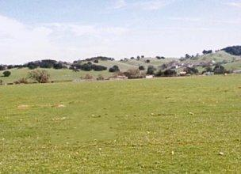

This project implements a simplified version of the algorithm described in "[Texture Synthesis by Non-parametric Sampling](https://www2.eecs.berkeley.edu/Research/Projects/CS/vision/papers/efros-iccv99.pdf)", by Efros and Leung.

There's a live demo of this algorithm at https://una-dinosauria.github.io/efros-and-leung-js/.

### Example 1

### Example 2

